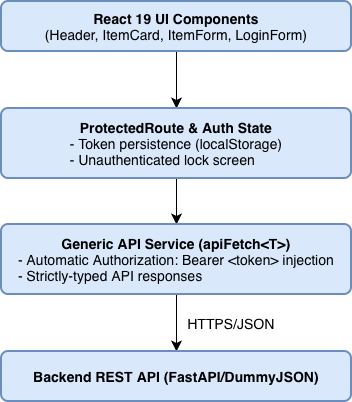

# Frontend Learning Sandbox
A frontend project built while learning React and TypeScript. It includes an inventory management dashboard, type-safe API integration with generic fetch wrappers, user authentication with JWT tokens, client-side protected routes, and interactive UI feedback with Tailwind CSS.

## Live Demo
The frontend is deployed live on Vercel:
-Web Application: https://frontend-learning-sandbox.vercel.app

## System Architecture



## Tech Stack
- **Frontend:** React 19, TypeScript
- **Build Tool:** Vite
- **Styling:** Tailwind CSS v4
- **Icons & Feedback:** Lucide React, React Hot Toast
- **Hosting:** Vercel

## Features
- Inventory management (view list, create new item, delete item)
- Type-safe generic API client (`apiFetch<T>`) for outgoing requests
- User authentication with JWT token storage in `localStorage`
- Client-side protected routes with lock screen when unauthenticated
- Interactive toast notifications for user feedback on actions
- Responsive layout built with TailwindCSS

## Repository Structure
```text
frontend-learning-sandbox/
    ├── frontend/                                                   #production React 19 Application
    │   ├── src/
    │   │   ├── components/                                         #reusable presentational & layout components
    │   │   │   ├── Footer.tsx                                      #backend live health badge
    │   │   │   ├── Header.tsx                                      #navbar with user status & auth buttons
    │   │   │   ├── ItemCard.tsx                                    #product card with price, tags & actions
    │   │   │   ├── ItemForm.tsx                                    #new item submission form
    │   │   │   ├── LoginForm.tsx                                   #modal dialog for user authentication
    │   │   │   └── ProtectedRoute.tsx                              #route guard with unauthorized lock screen
    │   │   ├── services/                                           #centralized business logic & network layer
    │   │   │   ├── api.ts                                          #generic apiFetch<T> wrapper & CRUD calls
    │   │   │   └── auth.ts                                         #JWT storage & session helpers
    │   │   ├── types/                                              #TypeScript type definitions & contracts
    │   │   │   ├── auth.ts                                         #user credential & token interfaces
    │   │   │   └── inventory.ts                                    #item, category & API response types
    │   │   ├── App.css
    │   │   ├── App.tsx                                             #central dashboard view & state coordinator
    │   │   ├── index.css                                           #global styles & Tailwind directives
    │   │   ├── main.tsx                                            #React root renderer
    │   ├── index.html                                              #Single Page Application (SPA) HTML entry
    │   ├── package-lock.json
    │   ├── package.json                                            #frontend dependencies & run scripts
    │   ├── tsconfig.json                                           #TypeScript compiler configuration
    │   └── vite.config.js                                          #Vite bundler & Tailwind CSS v4 configuration
    ├── es6_refresher.js                                            #ES6+ JavaScript foundations (array methods, destructuring)
    ├── fetch_demo.js                                               #asynchronous JavaScript & Fetch API practice
    ├── frontend-learning-sandbox_system_architecture.drawio.png    
    ├── README.md                                                   #project documentation and architecture guide
    ├── test_types.ts                                               #interface & union type validation
    └── typescript_basics.ts                                        #TypeScript type system exercises
```

## Local Development Setup

### Prerequisites

- Node.js 18+
- Git

### Installation

1. Clone the repository:
   ```bash
   git clone https://github.com/jorisejoanna/frontend-learning-sandbox.git
   cd frontend-learning-sandbox/frontend
   ```

2. Install dependencies:
    ```bash
    npm install
    ```

### Running Locally
```bash
npm run dev
```

### Building for Production
```bash
npm run build
```

## License
This project is licensed under the MIT License